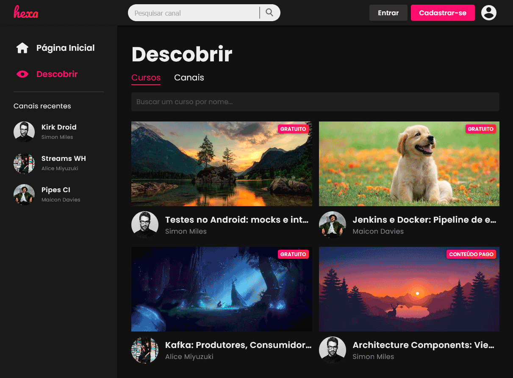

# Hexa Front-end

  Hexa é um serviço de conteúdo onde usuários podem publicar e organizar cursos e, além disso, permite que usuários inscrevam-se em canais e se registrem em cursos.

## Iniciando a aplicação
  \
  Utilizando npm ([Node.js](https://nodejs.org/en/)). Rode:

    npm run start

 

> ATENÇÃO! Link para o <a href="https://github.com/Pivetta21/hexa-back">repositório</a> do back-end.
